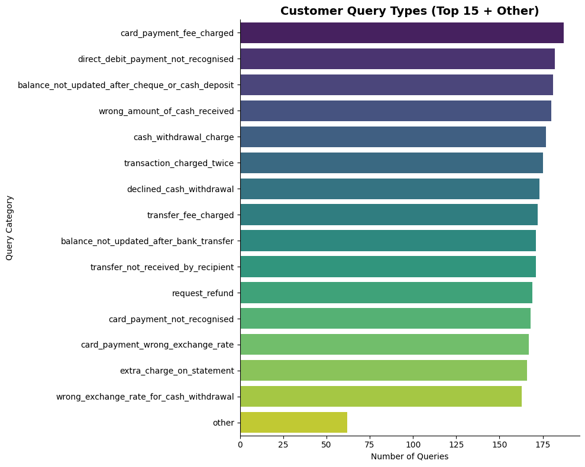

# Banking-intent-from-customers
## What is this project?
 This is an end-to-end AI engineering project for NLP text classification task by finetuning a modern transformer-based model with LoRA. It also has a comprehensive PII protection strategy to handle sensitive customer financial data needed to build production ready AI systems in highly regulated industries.

## Business Understanding
Understanding customer queries in banking is about determining the exact intent (the underlying goal of customer) behind what they type or say. Resolving this is so critical, as data shows that about 70-73% of financial service consumers will switch to a competitor after multiple bad experiences.

The problem boils down to bridge the gap between raw data which includes what custoer says and the resolutions is what bank needs to do. Addressing this would not debounce their customers to their competitors but enhances the existing relationship and customer might even stay with the bank for a long time as long as there is understanding! (a good experience)

Banks receive massive volumes of unstructured customer data daily through chat, email, and voice logs. Without automated intent recognition, banks face severe operational inefficiencies

## Objectives
The primary goal of this project is to automate the identification and routing of transaction disputes, billing inquiries, and transfer anomalies.
- Reduce Operational Costs: Deflect high-volume, repetitive inquiries (e.g., fee explanations) via automated self-service.- Accelerate Resolution Times (SLA): Instantly route high-risk transaction anomalies (e.g., unrecognized charges) to specialized risk teams.
- Enhance Retention: Minimize customer churn caused by frustrating delays during "missing money" kind of situations.

## Business Value & ROI
Implementing an effective intent recognition system yields measurable financial benefits:
- 70%+ Deflection Rate: AI chatbots instantly resolve routine intents without human intervention. Reduce the Average Handling Time (AHT) for transaction disputes by 30%.
- Smart Routing: High-value or complex intents route instantly to specialized human agents, boosting conversion. Achieve an automated query routing accuracy of >85% across the top categories.
- Decrease manual ticket triage volume by 50% through automated categorization.
- Proactive Analytics: Banks can track sudden spikes in specific intents 

Few of the top intents in the data:
``Index(['card_payment_fee_charged', 'direct_debit_payment_not_recognised',
       'balance_not_updated_after_cheque_or_cash_deposit',
       'wrong_amount_of_cash_received', 'cash_withdrawal_charge',
       'transaction_charged_twice', 'declined_cash_withdrawal',
       'transfer_fee_charged', 'balance_not_updated_after_bank_transfer',
       'transfer_not_received_by_recipient', 'request_refund',
       'card_payment_not_recognised', 'card_payment_wrong_exchange_rate',
       'extra_charge_on_statement', 'wrong_exchange_rate_for_cash_withdrawal'],
      dtype='object', name='category')``

# CRISP - DM
Here’s a simple CRISP-DM framework using Banking77 dataset:

1. Business Understanding: Use AI to automate classification of customer banking queries into predefined intent categories to improve routing, response time, and customer experience.

Improve first-response accuracy
Reduce manual triage time for customer support
2. Data Understanding: The Banking77 dataset contains labeled customer queries across 77 banking intent classes.

Inspect class distribution and identify imbalances
Analyze text lengths across intent classes
3. Data Preparation: Clean and preprocess text for modeling.

Normalize, pad, and/or truncate text
Tokenization using transformer-compatible tokenizers
4. Modeling: Finetuned transformer-based model for contextual understanding and performance.

Baseline: Multi-Layer Perceptron (MLP)
Advanced model: Finetuned RoBERTa using LoRA
5. Evaluation: Define classification performance metrics.

Primary metric: Macro F1 Score
Secondary metrics: Overall accuracy, precision, recall
Comparison: Baseline vs advanced model performance
6. Deployment: Save and load the finetuned LoRA-RoBERTa model.

AI ethics: Ensure data security and privacy of customer queries by redacting sensitive personally identifiable information (PII)
Inference pipeline: Customer query -> Redact PII -> Predict banking intent
Monitor: Track live performance, potential data drift, and collect data for retraining

## Mermaid diagram for it make sense
flowchart TD
    A["1 · Business understanding\nAutomate classification of customer queries into 77 banking intents\n↳ Improve first-response accuracy · Reduce manual triage time"]
    B["2 · Data understanding\nBanking77 — labeled queries across 77 intent classes\n↳ Class distribution & imbalance · Text length analysis"]
    C["3 · Data preparation\nClean and preprocess text for transformer-compatible input\n↳ Normalize · Pad & truncate · Tokenize"]
    D["4 · Modeling\nFinetuned transformer for contextual understanding"]
    E1["Baseline\nMLP classifier"]
    E2["Advanced\nRoBERTa + LoRA"]
    F["5 · Evaluation\nPrimary: Macro F1 · Secondary: accuracy, precision, recall\n↳ Baseline vs LoRA-RoBERTa comparison"]
    G["6 · Deployment\nSave & serve finetuned LoRA-RoBERTa\n↳ Monitor drift · collect data for retraining"]
    H["Customer query"] --> I["Redact PII"] --> J["Predict banking intent"]

    A --> B --> C --> D
    D --> E1 & E2
    E1 & E2 --> F --> G
    G --- H

    style A fill:#EEEDFE,stroke:#534AB7,color:#3C3489
    style B fill:#E1F5EE,stroke:#0F6E56,color:#085041
    style C fill:#E6F1FB,stroke:#185FA5,color:#0C447C
    style D fill:#FAECE7,stroke:#993C1D,color:#712B13
    style E1 fill:#F1EFE8,stroke:#5F5E5A,color:#444441
    style E2 fill:#FAECE7,stroke:#993C1D,color:#712B13
    style F fill:#FAEEDA,stroke:#854F0B,color:#633806
    style G fill:#E1F5EE,stroke:#0F6E56,color:#085041
    style H fill:#E1F5EE,stroke:#0F6E56,color:#085041
    style I fill:#FAECE7,stroke:#993C1D,color:#712B13
    style J fill:#EEEDFE,stroke:#534AB7,color:#3C3489

