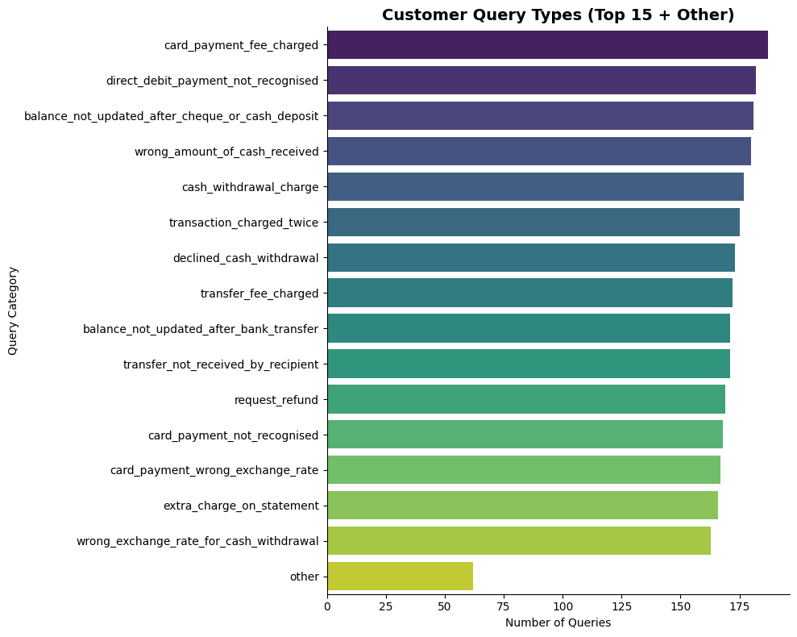
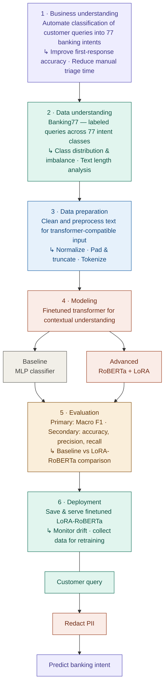
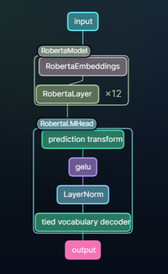

# Banking-intent-from-customers
## What is this project?
 This is an end-to-end AI engineering project for NLP text classification task by finetuning a modern transformer-based model with LoRA. It also has a comprehensive PII protection strategy to handle sensitive customer financial data needed to build production ready AI systems in highly regulated industries.

## Business Understanding
Understanding customer queries in banking is about determining the exact intent (the underlying goal of customer) behind what they type or say. Resolving this is so critical, as data shows that about 70-73% of financial service consumers will switch to a competitor after multiple bad experiences.

The problem boils down to bridge the gap between raw data which includes what custoer says and the resolutions is what bank needs to do. Addressing this would not debounce their customers to their competitors but enhances the existing relationship and customer might even stay with the bank for a long time as long as there is understanding! (a good experience)

Banks receive massive volumes of unstructured customer data daily through chat, email, and voice logs. Without automated intent recognition, banks face severe operational inefficiencies

## Objectives
The primary goal of this project is to automate the identification and routing of transaction disputes, billing inquiries, and transfer anomalies.
- Reduce Operational Costs: Deflect high-volume, repetitive inquiries (e.g., fee explanations) via automated self-service.- Accelerate Resolution Times (SLA): Instantly route high-risk transaction anomalies (e.g., unrecognized charges) to specialized risk teams.
- Enhance Retention: Minimize customer churn caused by frustrating delays during "missing money" kind of situations.

## Business Value & ROI
Implementing an effective intent recognition system yields measurable financial benefits:
- 70%+ Deflection Rate: AI chatbots instantly resolve routine intents without human intervention. Reduce the Average Handling Time (AHT) for transaction disputes by 30%.
- Smart Routing: High-value or complex intents route instantly to specialized human agents, boosting conversion. Achieve an automated query routing accuracy of >85% across the top categories.
- Decrease manual ticket triage volume by 50% through automated categorization.
- Proactive Analytics: Banks can track sudden spikes in specific intents 

## A look at the data
Few of the top intents in the data:
``Index(['card_payment_fee_charged', 'direct_debit_payment_not_recognised',
       'balance_not_updated_after_cheque_or_cash_deposit',
       'wrong_amount_of_cash_received', 'cash_withdrawal_charge',
       'transaction_charged_twice', 'declined_cash_withdrawal',
       'transfer_fee_charged', 'balance_not_updated_after_bank_transfer',
       'transfer_not_received_by_recipient', 'request_refund',
       'card_payment_not_recognised', 'card_payment_wrong_exchange_rate',
       'extra_charge_on_statement', 'wrong_exchange_rate_for_cash_withdrawal'],
      dtype='object', name='category')``




# CRISP - DM
Here’s a simple CRISP-DM framework using Banking77 dataset:

1. Business Understanding: Use AI to automate classification of customer banking queries into predefined intent categories to improve routing, response time, and customer experience.

Improve first-response accuracy
Reduce manual triage time for customer support

2. Data Understanding: The Banking77 dataset contains labeled customer queries across 77 banking intent classes.

Inspect class distribution and identify imbalances
Analyze text lengths across intent classes

3. Data Preparation: Clean and preprocess text for modeling.

Normalize, pad, and/or truncate text
Tokenization using transformer-compatible tokenizers

4. Modeling: Finetuned transformer-based model for contextual understanding and performance.

Baseline: Multi-Layer Perceptron (MLP)
Advanced model: Finetuned RoBERTa using LoRA

5. Evaluation: Define classification performance metrics.

Primary metric: Macro F1 Score
Secondary metrics: Overall accuracy, precision, recall
Comparison: Baseline vs advanced model performance

6. Deployment: Save and load the finetuned LoRA-RoBERTa model.

AI ethics: Ensure data security and privacy of customer queries by redacting sensitive personally identifiable information (PII)
Inference pipeline: Customer query -> Redact PII -> Predict banking intent
Monitor: Track live performance, potential data drift, and collect data for retraining

## Mermaid diagram for it to make sense

```mermaid
flowchart TD
    A["1 · Business understanding\nAutomate classification of customer queries into 77 banking intents\n↳ Improve first-response accuracy · Reduce manual triage time"]
    B["2 · Data understanding\nBanking77 — labeled queries across 77 intent classes\n↳ Class distribution & imbalance · Text length analysis"]
    C["3 · Data preparation\nClean and preprocess text for transformer-compatible input\n↳ Normalize · Pad & truncate · Tokenize"]
    D["4 · Modeling\nFinetuned transformer for contextual understanding"]
    E1["Baseline\nMLP classifier"]
    E2["Advanced\nRoBERTa + LoRA"]
    F["5 · Evaluation\nPrimary: Macro F1 · Secondary: accuracy, precision, recall\n↳ Baseline vs LoRA-RoBERTa comparison"]
    G["6 · Deployment\nSave & serve finetuned LoRA-RoBERTa\n↳ Monitor drift · collect data for retraining"]
    H["Customer query"] --> I["Redact PII"] --> J["Predict banking intent"]

    A --> B --> C --> D
    D --> E1 & E2
    E1 & E2 --> F --> G
    G --- H

    style A fill:#EEEDFE,stroke:#534AB7,color:#3C3489
    style B fill:#E1F5EE,stroke:#0F6E56,color:#085041
    style C fill:#E6F1FB,stroke:#185FA5,color:#0C447C
    style D fill:#FAECE7,stroke:#993C1D,color:#712B13
    style E1 fill:#F1EFE8,stroke:#5F5E5A,color:#444441
    style E2 fill:#FAECE7,stroke:#993C1D,color:#712B13
    style F fill:#FAEEDA,stroke:#854F0B,color:#633806
    style G fill:#E1F5EE,stroke:#0F6E56,color:#085041
    style H fill:#E1F5EE,stroke:#0F6E56,color:#085041
    style I fill:#FAECE7,stroke:#993C1D,color:#712B13
    style J fill:#EEEDFE,stroke:#534AB7,color:#3C3489
```

## One of the few observations when evaluating the model with MLP

> [!WARNING]
> **Model Limitation**
>
> Although the MLP achieves a strong overall accuracy of **88%** with a macro F1-score of **0.88**, there is still significant room for improvement. Some business-critical intents exhibit relatively low precision and/or recall. For example, the intent **`balance_not_updated_after_bank_transfer`** achieves only **60% precision**, meaning that approximately **40%** of predictions assigned to this intent are incorrect. In a customer support setting, such misclassifications could route users to the wrong resolution workflow, negatively impacting customer experience.

## Heading to use Roberta


### A look at Roberta Layer 
| Property              | Value          |
| --------------------- | -------------- |
| Model                 | `roberta-base` |
| Layers                | 12             |
| Hidden Size           | 768            |
| Attention Heads       | 12             |
| Head Dimension        | 64             |
| Context Length        | 514            |
| FFN Intermediate Size | 3,072          |
| Attention Type        | Self-Attention |

### Language Modeling Head (`lm_head.decoder`)

| Component       | Value             |
| --------------- | ----------------- |
| Module Type     | `Linear`          |
| Module Path     | `lm_head.decoder` |
| Vocabulary Size | 50,265            |

**Purpose:** Projects the final hidden representation (`768` dimensions) into the vocabulary space (`50,265` tokens) to produce token prediction logits during Masked Language Modeling (MLM).

### RoBERTa vs the standard BERT: Architectural Differences
At a high level, RoBERTa is not a new architecture. It uses essentially the same Transformer encoder architecture as BERT:
| Component               | BERT Base | RoBERTa Base |
| ----------------------- | --------- | ------------ |
| Layers                  | 12        | 12           |
| Hidden Size             | 768       | 768          |
| Attention Heads         | 12        | 12           |
| Head Dimension          | 64        | 64           |
| Encoder-only            | Yes       | Yes          |
| Bidirectional Attention | Yes       | Yes          |

Because of this, both are excellent for:

- Text classification
- Sentiment analysis
- Intent detection
- NER
- Semantic similarity
- Question answering

### Then What RoBERTa Changed

The improvements come almost entirely from pretraining strategy, not architecture.
| Feature                        | BERT        | RoBERTa     |
| ------------------------------ | ----------- | ----------- |
| Next Sentence Prediction (NSP) | ✅ Used      | ❌ Removed   |
| Dynamic Masking                | ❌ Static    | ✅ Dynamic   |
| Training Data Size             | ~16GB       | ~160GB      |
| Training Duration              | Shorter     | Much Longer |
| Batch Size                     | Smaller     | Larger      |
| Byte-Pair Encoding             | ❌ WordPiece | ✅ BPE       |

1. Removed NSP

BERT learns two tasks:

- Masked Language Modeling (MLM)
- Next Sentence Prediction (NSP)

Researchers later found NSP contributes little to downstream performance. RoBERTa removes NSP entirely and focuses all capacity on MLM.

2. Dynamic Masking

#### BERT:
```
Epoch 1:
The [MASK] is red

Epoch 2:
The [MASK] is red
```

Same token remains masked.
##### RoBERTa
```
Epoch 1:
The [MASK] is red

Epoch 2:
The apple is [MASK]
```

- Mask locations change every epoch.

- This exposes the model to far more prediction patterns and improves language understanding.

### 3. Training on Significantly Larger and More Diverse Data

One of the most impactful improvements in RoBERTa comes from the scale and diversity of its pretraining corpus.

| Model       | Training Data                                                           |
| ----------- | ----------------------------------------------------------------------- |
| **BERT**    | BooksCorpus + English Wikipedia (~16GB)                                 |
| **RoBERTa** | BooksCorpus, Wikipedia, Common Crawl, OpenWebText, and Stories (~160GB) |

By training on nearly **10× more data**, RoBERTa is exposed to a much broader range of vocabulary, writing styles, sentence structures, and contextual relationships. This allows the model to learn richer language representations and improve its understanding of real-world text.

### Why RoBERTa Often Performs Better

Although BERT and RoBERTa share the same underlying Transformer encoder architecture, RoBERTa generally achieves stronger downstream performance due to its improved pretraining strategy.

| Model            | Typical Performance                                          |
| ---------------- | ------------------------------------------------------------ |
| **BERT Base**    | Strong baseline                                              |
| **RoBERTa Base** | Typically 1–4% higher performance across many NLP benchmarks |

Some key reasons for this improvement include:

* Better contextual embeddings learned from larger and more diverse training data.
* Improved handling of rare words and less common language patterns.
* More robust sentence representations due to dynamic masking.
* Better generalization to unseen examples and downstream tasks.

As a result, RoBERTa has become a widely adopted replacement for BERT in many text understanding applications, including:

* Sentiment Analysis
* Intent Classification
* Financial NLP
* Customer Support Routing
* Toxicity Detection
* Text Classification
* Named Entity Recognition (NER)
